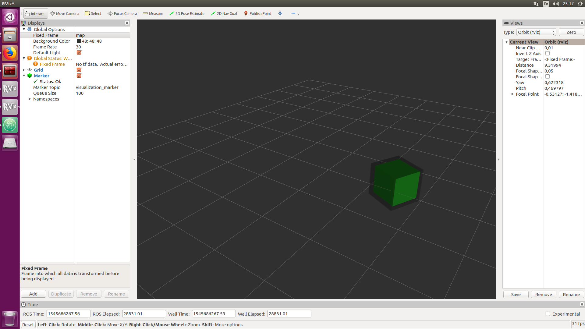

# SimpleTracking
Simple object tracking based on constant acceleration cinematic model and Kalman filtering.

## Prerequisites
* [ROS](http://wiki.ros.org/Installation/Ubuntu)
* [Catkin](http://docs.ros.org/melodic/api/catkin/html/user_guide/installation.html)

## Installation
`git clone --recursive https://github.com/mihaigalos/SimpleTracking.git`

## Building
```
cd SimpleTracking
catkin init
catkin build
```
In case of problems, try building with `catkin build --limit-status-rate 1 -j2`.
## Running
Of course all of your terminals need to source ROS as a first step..
```
source /opt/ros/melodic/setup.zsh
roscore &
source devel/setup.zsh
python src/tracking.py
```
Fire up rviz with `rviz launch/default_rviz.rviz &`. The tracker automatically
publishes on `/visualization_marker`, so no need to adjust anything. You should see a moving green box
and over it, the predicted position for it, in a dark semi-transparent cube.

## Screenshot

